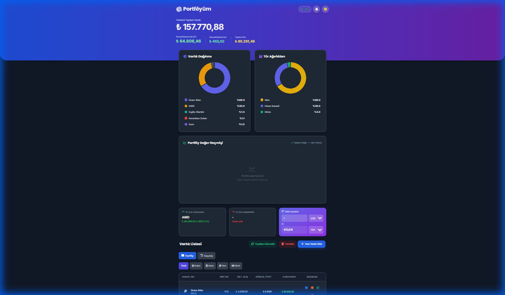

<p align="center">
  
  
  
  
</p>

<h1 align="center">💰 NeoPort</h1>
<p align="center"><strong>Kişisel Yatırım Portföy Takip Uygulaması</strong></p>
<p align="center">Kripto, hisse, döviz ve altın yatırımlarınızı tek yerden takip edin.</p>

---

## 📸 Ekran Görüntüsü

<p align="center">
  
</p>

---

## ✨ Özellikler

| Özellik | Açıklama |
|---------|----------|
| 📊 **Portföy Takibi** | Tüm varlıklarınızı tek ekranda görün |
| 💱 **Çoklu Varlık Türü** | Kripto, hisse senedi, döviz, altın |
| ⚡ **Gerçek Zamanlı Fiyatlar** | CoinGecko, Finnhub, Exchange Rate API |
| 📈 **Grafikler** | Dağılım pasta grafiği, tip bazlı analiz |
| 🌙 **Dark Mode** | Göz yormayan karanlık tema |
| 📱 **Responsive** | Mobil uyumlu tasarım |
| 🔔 **Fiyat Alarmları** | Hedef fiyat bildirimleri |
| 💾 **Otomatik Yedekleme** | Günlük veritabanı yedeği |
| 📄 **API Dokümantasyonu** | Swagger UI |

---

## 🚀 Hızlı Başlangıç

### Gereksinimler
- Node.js v18 veya üzeri
- npm v9 veya üzeri

### Kurulum

```bash
# Repoyu klonla
git clone https://github.com/fth530/neoport.git
cd neoport

# Bağımlılıkları yükle
npm install

# Geliştirme sunucusunu başlat
npm run dev
```

Tarayıcıda aç: **http://localhost:3000**

---

## 📦 Kullanılabilir Komutlar

| Komut | Açıklama |
|-------|----------|
| `npm start` | Sunucuyu başlat |
| `npm run dev` | Development mode |
| `npm run build` | TailwindCSS build |
| `npm run css:watch` | CSS değişikliklerini izle |
| `npm run prod` | PM2 ile production başlat |
| `npm test` | API testlerini çalıştır |
| `npm run test:all` | Tüm testleri çalıştır |

---

## 🛠️ Teknoloji Stack

<table>
<tr>
<td>

**Backend**
- Node.js
- Express.js
- SQLite (sql.js)
- Socket.IO

</td>
<td>

**Frontend**
- Vanilla JavaScript
- TailwindCSS v3
- Chart.js
- Font Awesome

</td>
<td>

**Güvenlik**
- Helmet.js
- Rate Limiting
- Input Sanitization
- CORS

</td>
</tr>
</table>

---

## 📁 Proje Yapısı

```
neoport/
├── server.js              # Express sunucu
├── database.js            # Veritabanı işlemleri
├── priceService.js        # Fiyat API servisi
├── middleware/            # Express middleware'ler
├── migrations/            # Veritabanı migrationları
├── public/                # Statik dosyalar
│   ├── js/app.js          # Frontend logic
│   └── css/styles.css     # Built CSS
├── src/                   # Kaynak dosyalar
│   └── input.css          # TailwindCSS source
└── docs/                  # Dokümantasyon
```

---

## 🐳 Docker ile Çalıştırma

```bash
# Build
docker build -t neoport .

# Çalıştır
docker run -d -p 3000:3000 neoport

# Veya docker-compose ile
docker-compose up -d
```

---

## 📖 API Endpoints

| Method | Endpoint | Açıklama |
|--------|----------|----------|
| GET | `/api/v1/assets` | Tüm varlıkları listele |
| POST | `/api/v1/assets` | Yeni varlık ekle |
| POST | `/api/v1/assets/:id/buy` | Alım işlemi |
| POST | `/api/v1/assets/:id/sell` | Satış işlemi |
| GET | `/api/v1/summary` | Portföy özeti |
| GET | `/api/v1/transactions` | İşlem geçmişi |
| POST | `/api/v1/prices/refresh` | Fiyatları güncelle |

**Swagger Dokümantasyonu:** http://localhost:3000/api-docs

---

## ⚙️ Ortam Değişkenleri

`.env` dosyası oluşturun:

```env
NODE_ENV=development
PORT=3000
FINNHUB_API_KEY=your_api_key_here
```

---

## 🔒 Güvenlik

- ✅ Helmet.js ile güvenlik headers
- ✅ Rate limiting (DDoS koruması)
- ✅ Input sanitization (XSS koruması)
- ✅ SQL injection koruması (prepared statements)
- ✅ CORS konfigürasyonu
- ✅ Content Security Policy

---

## 🤝 Katkıda Bulunma

1. Fork edin
2. Feature branch oluşturun (`git checkout -b feature/amazing-feature`)
3. Commit edin (`git commit -m 'Add amazing feature'`)
4. Push edin (`git push origin feature/amazing-feature`)
5. Pull Request açın

---

## 📄 Lisans

Bu proje MIT lisansı altında lisanslanmıştır. Detaylar için [LICENSE](LICENSE) dosyasına bakın.

---

<p align="center">
  <strong>NeoPort</strong> ile yatırımlarınızı kontrol altında tutun! 📈
</p>
